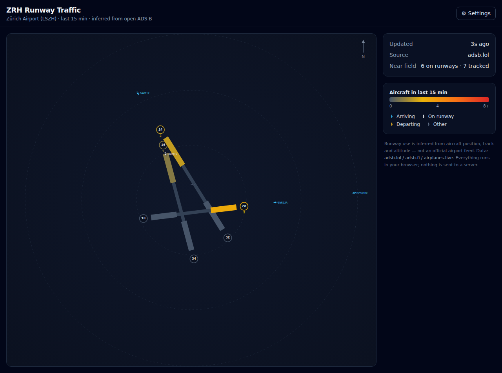

# zrh-airport

Live visualisation of runway traffic at **Zurich Airport (LSZH / ZRH)** — a
single-page app that runs **entirely in your browser**. No backend, no server,
no account.

It draws a schematic of ZRH's three runways and, for each runway **end**,
colours it by how many distinct aircraft have used it in the **last 15 minutes**
(grey → red heat scale). Live aircraft near the field are drawn as Flightradar-style
plane icons, tinted by flight phase (arriving / on runway / departing).



## How it works

- **Data**: open, no-key, CORS-friendly ADS-B feeds — [adsb.lol](https://adsb.lol),
  [adsb.fi](https://adsb.fi) and [airplanes.live](https://airplanes.live), queried
  by radius around the airport and failed over automatically. Polled every ~45 s.
- **Runway inference**: each aircraft's position, track and altitude are snapped to
  the runway centrelines to decide which end (if any) it is using. This is a
  heuristic — **not an official airport feed**.
- **Storage**: the rolling 15-minute window lives in **IndexedDB**; user settings
  in **localStorage**. Nothing leaves your browser.
- The default data source needs no credentials. A settings dialog lets you tune the
  refresh interval, query radius and provider, and stores an optional API token
  locally should a provider ever require one.

## Stack

React 19 · TypeScript · Vite 6 · TanStack Query · Tailwind CSS v4 · IndexedDB
(`idb-keyval`) · Vitest.

## Develop

```bash
npm install
npm run dev       # start the dev server
npm run test      # unit tests (runway assignment + rolling-window counts)
npm run build     # type-check + production build to dist/
npm run preview   # serve the production build
```

The build uses a relative `base`, so `dist/` deploys as-is to GitHub Pages or any
static host.

## Limitations

- Runway use is **inferred**, not authoritative; ADS-B coverage and the geometric
  heuristic can misattribute or miss traffic.
- Quiet periods (e.g. overnight) will correctly show little or no traffic.
- Community ADS-B APIs are rate-limited and may change; the app fails over between
  them and keeps the last good data on screen with an "age" indicator.
